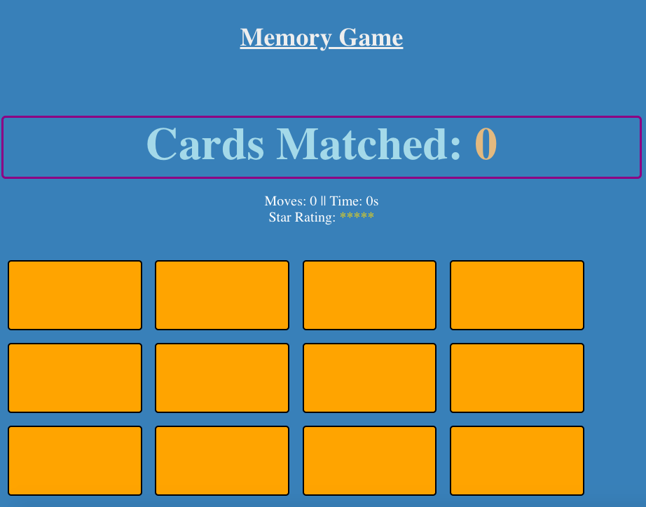
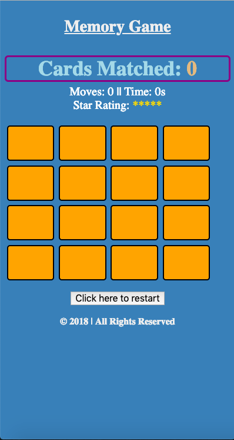
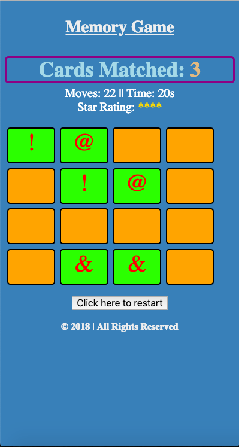
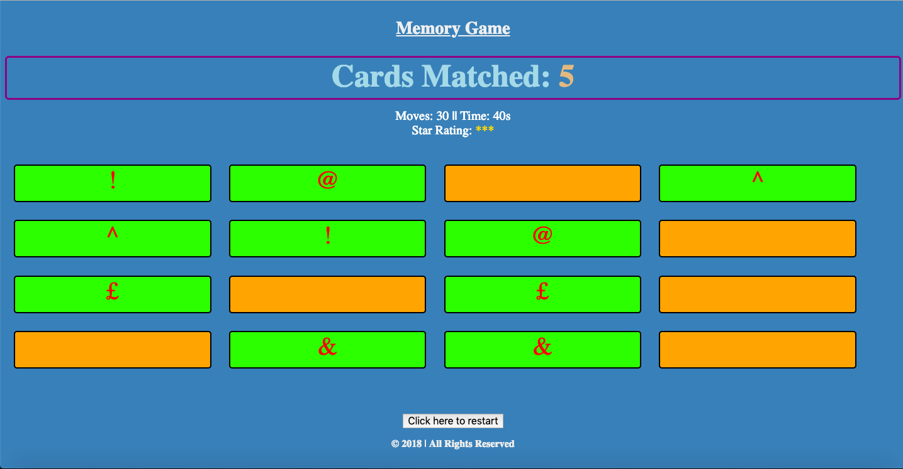
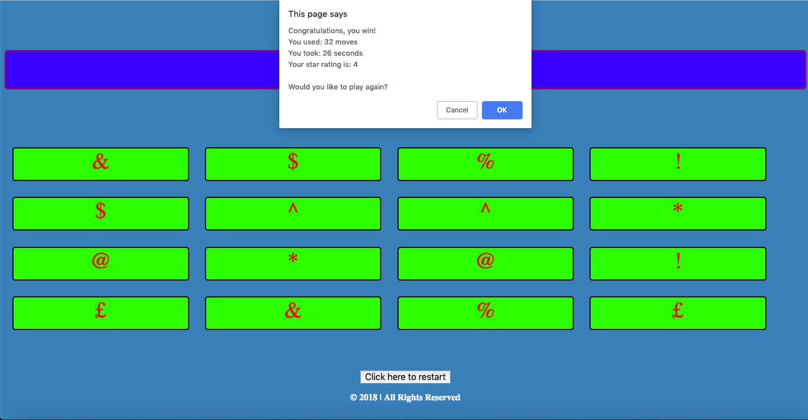

# Memory Game

### How to start
> 1. Open the project folder
> 2. Right click the file named _index.html_
> 3. Choose the _open with_ option
> 4. Open the game in a broswer of your choice

### How to use
> In this game you try to match all the cards that share the same symbol
> Once you match all 16 cards you win the game

### Requirements
> This game requires a broswer to run
> The broswer must have Javascript available and enabled

### Preview

**Thank you for viewing this project :)**
